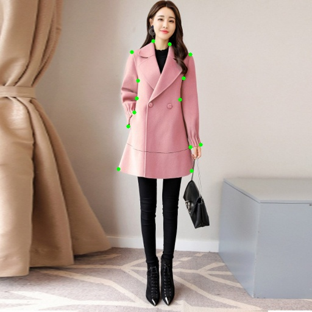
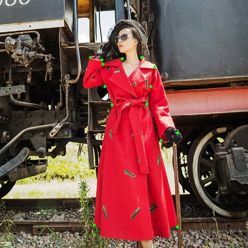
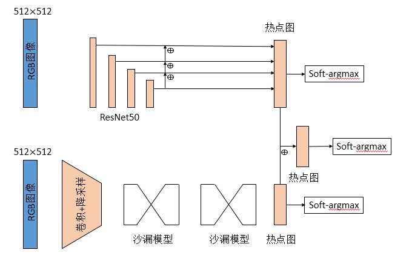

## fashionAI 服装关键点检测

> 天池算法大赛服装关键点检测，给定五种类型的服装，采用人体姿态估计的方法检测关键点。

### 0.效果预览

<figure class="half">
    
    
</figure>

### 1.模型

模型结合了HourGlass模型和CPN模型，其中HG堆叠了2个，另外在HG上采样过程的1/2大小的特征图上添加了热点图监督标签。

RGB图像送入两个分支网络分别计算，最后concat二者的特征图，具体结构如图所示。

添加了soft-argmax层，可以由热点图转化到具体的坐标值，用坐标值groundtruth监督学习



### 2.策略

最多只能使用两个不同参数的模型，检测模型也算。通过检测可以提高目标占比，提升效果。

使用第一级预测结果截取目标，为了防止截取不完整，向外扩展30像素，再训练第二级crop模型。

第一级模型testB线上4.17%，crop之后的模型testB线上4.05%，融合之后3.95%.

### 3.训练与预测细节

- 优化器Adam，学习率1e-3，每过10个epoch乘0.1，CPN的残差网络部分，学习率为全局学习率的0.1倍。

- 初始化，HG用了[开源](https://github.com/bearpaw/pytorch-pose)的一个人体姿态估计参数初始化，CPN残差部分用Imagenet预训练参数。

- 高斯热点图的亮块大小为13x13，输入图像512，输出热点图大小128

- 数据增强，颜色变换，旋转变换

- 图片扩展至512而不是直接resize，左右居中。

- 预测时，正向和水平翻转各预测一遍，再平均结果

### 4.数据准备

训练数据集fashionAI_key_points_train_20180227.tar.gz和[update] warm_up_train_20180222.tar解压后的Image一起放在data/train中,并将两个训练数据集的train.csv合并成trainnew.csv,再从中划分出验证集valid.csv

测试数据fashionAI_key_points_test_b_20180418.tgz解压后放入testb文件夹,应该放入的是Images文件夹和test.csv

HG模型初始化使用了MPII人体关键点数据预训练


### 5.运行环境

> pytorch 0.3.0

> visdom 用于训练损失曲线可视化

### 6.程序运行

程序运行为.sh脚本执行,將会训练模型,对testb做预测并生成提交结果.

train.sh 执行训练程序,每次训练5个模型,并保存在checkpoint文件夹

submit.sh 执行测试提交程序,將生成提交文件.csv

python demo.py 可以看两级预测结果与最后的融合结果

```shell
chmod +x ./train.sh
./train.sh

chmod +x ./submit.sh
./submit.sh
```